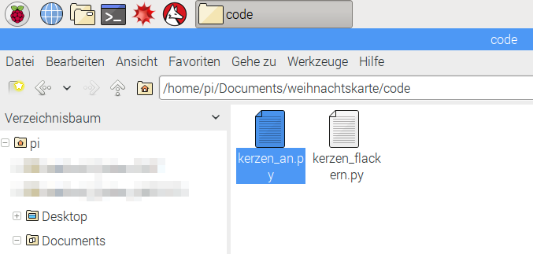
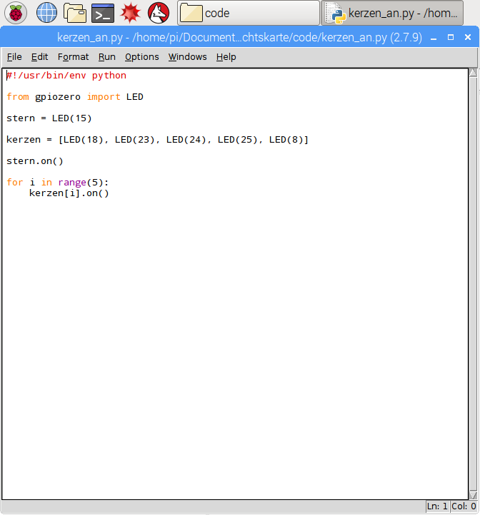
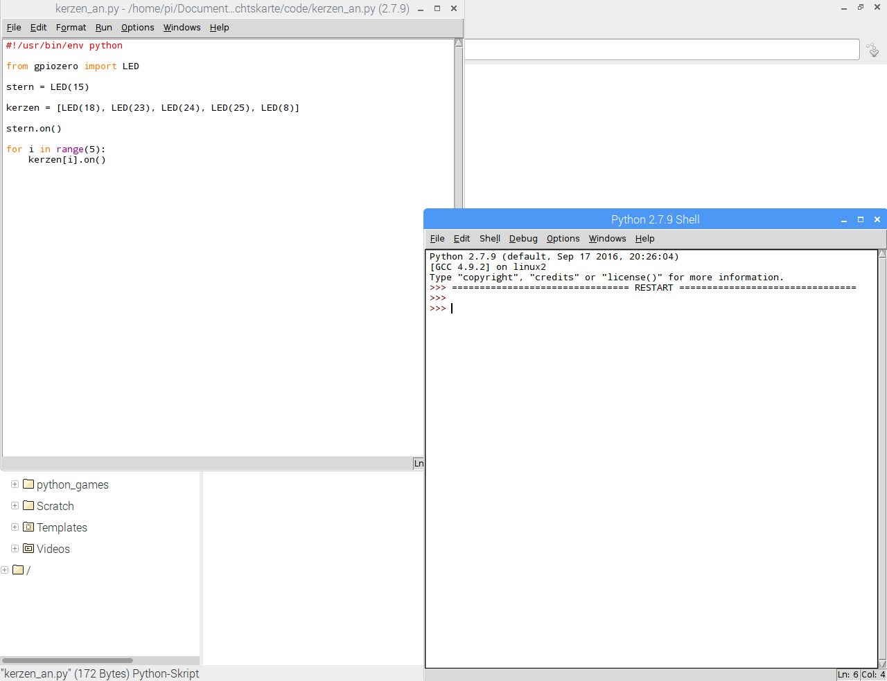

# Weihnachtskarte

Die Anleitung funktioniert nur mit der Weihnachtskarte, die ich dieses Jahr (2016) versendet habe.

## Material
Raspberry Pi (funktioniert mit allen Modellen)

## Software

Zu nächst ein paar notwendige Updates, damit die weiteren Schritte auch funktionieren.

```
sudo apt-get update
sudo apt-get install git
```

Lade dir jetzt das passende Github-Repository
für die weihnachtskarte herunter

```
cd Documents
git clone https://github.com/pediehl/weihnachtskarte.git
```
## Aufbau

Die passenden Widerstände sind innerhalb der Karte enthalten.
Für deinen Raspberry Pi musst du keine Veränderungen vornehmen. Das Kabel für den Stern (gelb markiert) kommt auf Pin 15 und die gemeinsame Masse (hier schwarz markiert, kann aber auch ein braunes Kabel sein) auf GND (die beiden Kabel habe ich beschriftet, bitte beachten!). Die Kerzen werden auf die Pins 18, 23, 24, 25 und 8 aufgesteckt (die Kabel für die Kerzen sind in der Zeichnung orange dargestellt) .


## Beispiele starten
Auf deinem Raspberry solltest du jetzt unter **Documents** einen weiteren Ordner **weihnachtskarte** haben. Öfnne den Ordner **weihnachtskarte** und gehe auf **code**. Hier gibt es zwei Python-Skripte. die nun starten kannst.

* kerzen_an.py
* kerzen_flackern.py

## Wie starte ich das Python-Skript auf meinem Raspbery Pi?
1. Wechsel in den Ordner **Documents/weihnachtskarte/**
2. Wähle eine Datei und starte die Datei mit einem Doppel-Klick.
3. Starte das Programm mit F5.

Schritt 1: Wechsel in den Ordner **Documents/weihnachtskarte/**


Schritt2: Wähle eine Datei und starte die Datei mit einem Doppel-Klick.


Schritt3: Starte das Programm mit F5


Viel Spass beim Experimentieren!

Wünsche dir ein schönes Weihnachtsfest!
